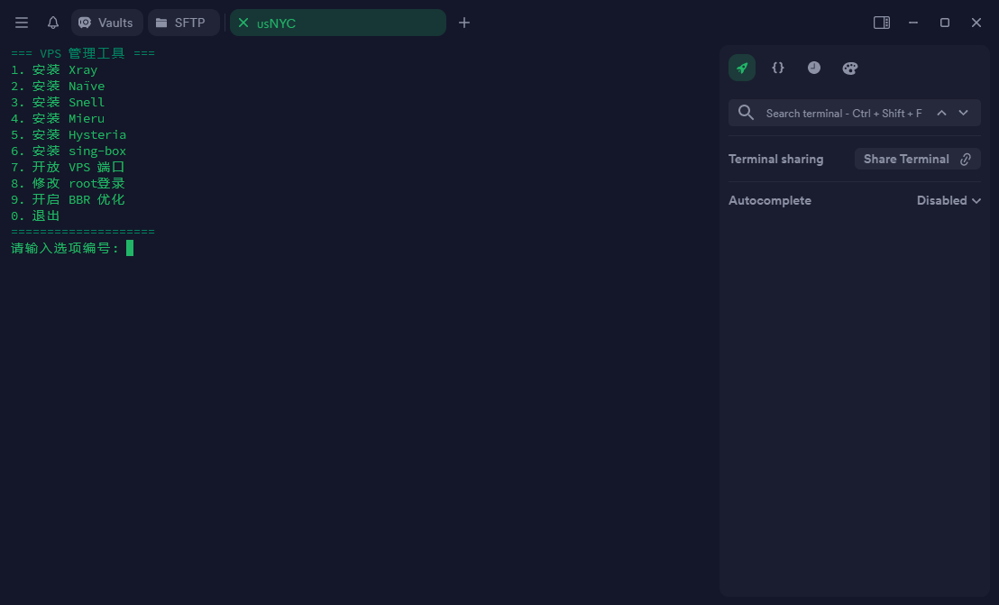

## 终端预览



## 一键脚本
```
bash <(curl -fsSL vps-psi.vercel.app)
```
## 常用指令
查看进程
```
sudo ss -tulnp
```
停止进程
```
sudo kill pid
```
查看 Docker
```
sudo docker ps
```
停止 Docker
```
sudo docker start nginx
```
启动 Docker
```
sudo docker start nginx
```
生成 Base64
```
openssl rand -base64 16
```
